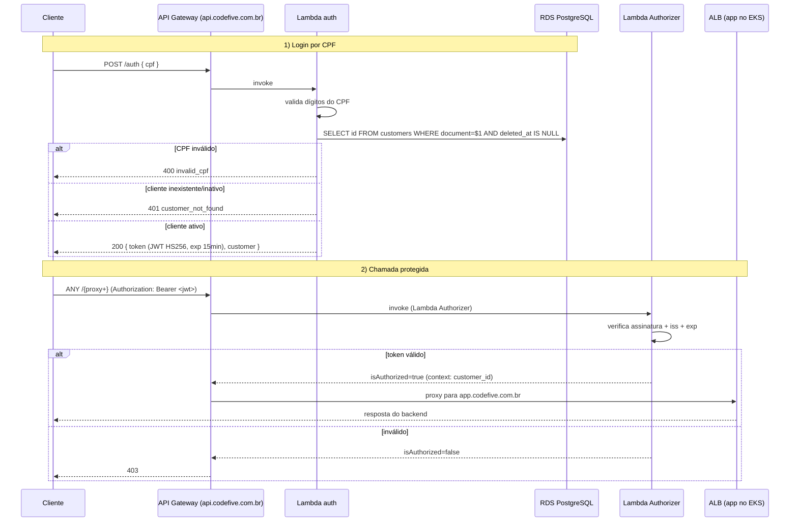

# oficina-auth-lambda

Autenticação **serverless por CPF** do **Tech Challenge Fase 3 — Oficina Mecânica**. É o **repositório 1 de 4**: uma **AWS Lambda** valida o CPF, consulta o cliente no RDS e emite um **JWT HS256**; um **Lambda Authorizer** valida esse JWT no **API Gateway HTTP API**, que protege as rotas sensíveis e faz proxy para o backend no EKS.

| Repo | Papel |
|---|---|
| [oficina-k8s-infra](https://github.com/MicaelHernandes/oficina-k8s-infra) | VPC, EKS, ECR, ALB, DNS/TLS, monitoring, OIDC |
| [oficina-db-infra](https://github.com/MicaelHernandes/oficina-db-infra) | RDS PostgreSQL gerenciado |
| **oficina-auth-lambda** (este) | Lambda de auth por CPF + API Gateway |
| [oficina-api](https://github.com/MicaelHernandes/oficina-api) | Aplicação Laravel no EKS |

## Tecnologias

- **Node.js 22 / TypeScript**, build com **esbuild**, testes com **Vitest**.
- **jsonwebtoken** (HS256), **pg** (PostgreSQL).
- **AWS Lambda** (auth dentro da VPC; authorizer fora), **API Gateway HTTP API**, **Secrets Manager**, **Terraform**.

## Fluxo de autenticação



## Endpoints

| Rota | Auth | Destino |
|---|---|---|
| `POST /auth` | pública | Lambda de auth (emite JWT) |
| `ANY /{proxy+}` | Lambda Authorizer (Bearer JWT) | proxy HTTP para o ALB (`app.codefive.com.br`) |

### Exemplo

```bash
# Login
curl -X POST https://api.codefive.com.br/auth \
  -H 'content-type: application/json' \
  -d '{"cpf":"529.982.247-25"}'
# -> { "token": "eyJ...", "token_type": "Bearer", "expires_in": 900, "customer": {...} }

# Rota protegida
curl https://api.codefive.com.br/api/order-services \
  -H "Authorization: Bearer eyJ..."
```

## Detalhes do JWT

- Algoritmo **HS256**, claims: `sub` = `customer_id`, `cpf` = documento (dígitos), `iss` = `oficina-auth`, `exp` = 15 min.
- A `JWT_SECRET` é criada por este repo em **Secrets Manager** (`/oficina/jwt/secret`) e **compartilhada** com o app Laravel (repo 4), que valida o mesmo token.

> **Nota de schema:** a tabela `customers` usa a coluna **`document`** (CPF/CNPJ), não `cpf`; "inativo" é **soft delete** (`deleted_at`). A query considera ativo `deleted_at IS NULL`.

## Desenvolvimento

```bash
npm install
npm test          # Vitest
npm run typecheck # tsc --noEmit
npm run build     # esbuild -> dist/auth e dist/authorizer
```

## Deploy

- **`ci.yml`** (PR e push em `homolog`/`master`): typecheck + testes + build + `terraform plan` (comentado no PR). Sem apply.
- **`deploy.yml`** (push em `master`, `environment: production`): testes + build + `terraform apply` (em `infra/`).

Requer no repo os secrets **`AWS_ROLE_ARN`** (role OIDC `oficina-gha-oficina-auth-lambda`, criada pelo repo 2) e **`CLOUDFLARE_API_TOKEN`**, e o environment `production`.

## Dependência de ordem

Lê via **SSM** (`/oficina/*`) os outputs dos repos 2 (`vpc_id`, `private_subnet_ids`, `certificate_arn`) e 3 (`db endpoint/port/name`, `secret_arn`, `security_group_id`). Portanto **os repos 2 e 3 precisam estar aplicados antes**. Este repo adiciona a regra de SG que libera a Lambda no RDS.

## Infraestrutura criada (`infra/`)

Lambda `oficina-auth` (VPC) + `oficina-authorizer`, IAM roles, API Gateway HTTP API (`oficina-api`), Lambda Authorizer, rotas, stage `$default`, custom domain `api.codefive.com.br` (ACM do repo 2 + CNAME Cloudflare), secret `/oficina/jwt/secret`, SG da Lambda e regra 5432 no RDS.

## Custo

Lambda + API Gateway HTTP API: praticamente Free Tier no volume da apresentação. **Destruir após a apresentação** (`terraform destroy` em `infra/`).
